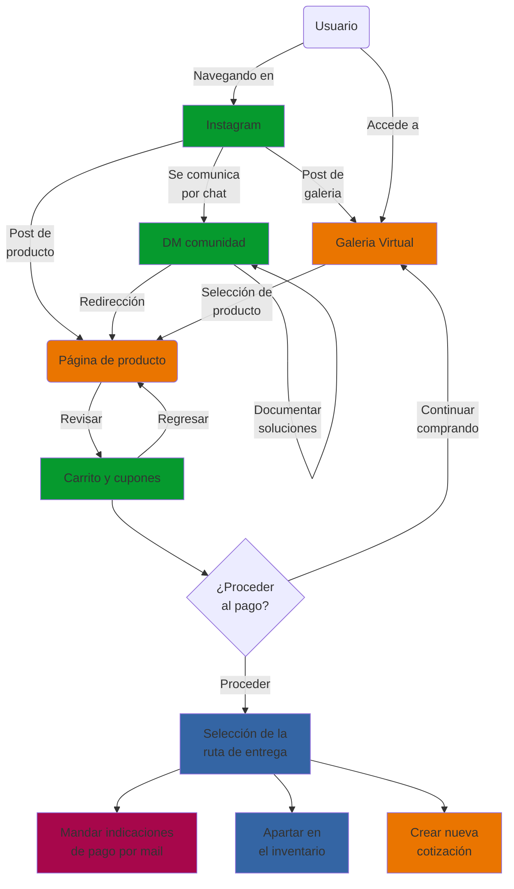

# Flujo de compra
El flujo de compra describe los pasos que debe seguir unx clientx para realizar una compra en la página web.

## Relevancia y suposiciones
El flujo de compra es un flujo de primera prioridad para pulsar, es el canal mediante el que le colectivo se mantiene y florece.

Este flujo está diseñado para funcionar con las personas del segmento A de clientes.

## Diagrama del Flujo

## Pruebas funcionales
Las pruebas se dividen en dos categorias

### Pruebas de comunidad
Pruebas a cada una de las flechas del flujo que van desde el Usuario, a traves de Instagram y la Galeria Virtual, y que terminan en llegar a la página del producto. 

### Pruebas de ventas
Pruebas a cada una de las flechas del flujo que van desde la página del producto y que terminan en generar los tres entregables. 
