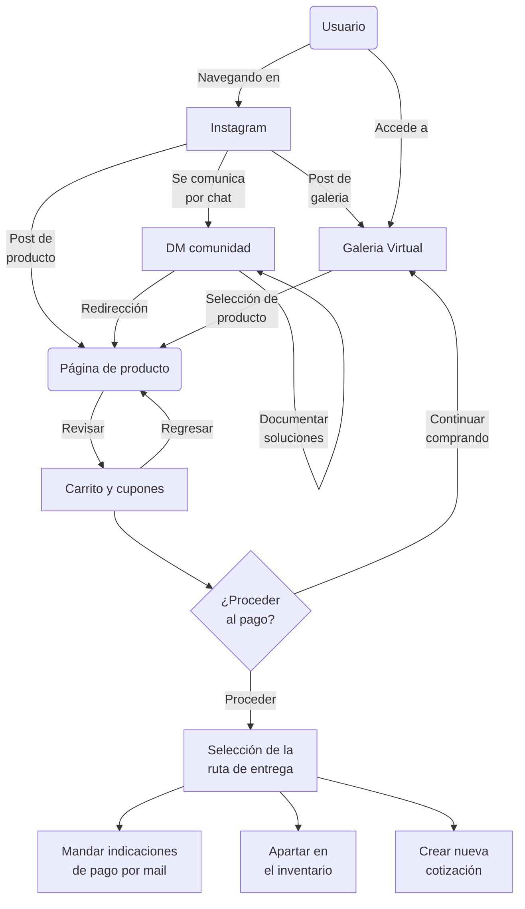

# Flujo de compra
El flujo de compra describe los pasos que debe seguir unx clientx para realizar una compra en la página web.

## Relevancia y suposiciones
El flujo de compra es un flujo de primera prioridad para pulsar, es el canal mediante el que le colectivo se mantiene y florece.

Este flujo está diseñado para funcionar con las personas del segmento A de clientes.

## Diagrama del Flujo

